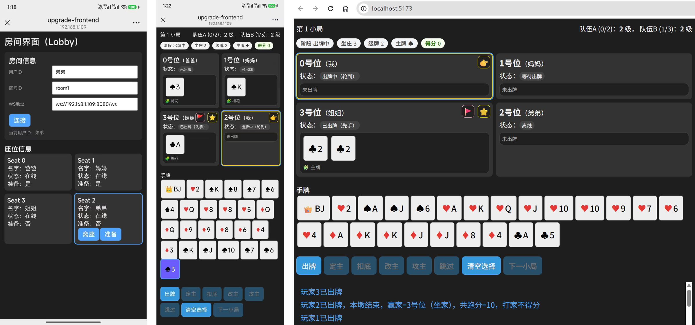

本项目是一个基于 Go + WebSocket + Vue 实现的局域网多人在线“升级”游戏。

游戏界面展示




# 文件目录

/前后端启动

    /cmd/server/main.go            后端入口，启动命令：go run ./cmd/server
    /frontend/src/...              前端代码，启动命令：npm --prefix .\frontend run dev


/internal/ws/                  WebSocket 连接层

      hub.go           # 全局ws hub：连接管理、广播
      conn.go          # 单连接读写、心跳、鉴权

/internal/room/                  房间管理（非规则）

      room.go          # 房间生命周期、玩家入座准备
      router.go        # 事件路由：把客户端event送进game reducer
      manager.go       # 房间管理器

/internal/game/

      rules/
          card.go        # 卡牌基本数据结构
          compare.go     # 牌型比较
          deck.go        # 发牌、洗牌
          follow.go      # 跟牌约束
          pattern.go     # 牌域识别（主副牌）、牌型识别（单/对/拖拉机/甩牌）
          score.go       # 分牌计算、末墩抠底倍数、结算升级
          sort.go        # 手牌排序
          trump.go       # 定主/改主/攻主/硬主规则
      error.go         # 错误处理
      events.go        # 客户端、服务端事件
      reducer.go       # 处理核心 (state, event) -> newState + outputs
      snapshot.go      # 客户端消息
      state.go         # 游戏状态
      utils.go         # 工具函数

# 环境说明
    go   1.24       （go version）
    npm  10.9.0     （npm -v）
    node v22.12.0   （node -v）

# 使用说明:
    后端：
      拉取依赖 go mod tidy
      启动后端 go run ./cmd/server
      此时后端默认监听地址：http://localhost:8080
    
    前端：
      进入目录 cd frontend
      安装依赖 npm install
      修改后端地址 将frontend/src/components/ConnectionPanel.vue中的wsBase替换为当前服务器IP
      启动前端 npm --prefix .\frontend run dev

    用户：
      与服务器连接同一局域网
      访问网址 http://{IP地址}:5173/ (通过ipconfig查询服务器IP地址)

# 游戏规则

本游戏按照孝汾地区的民间升级规则开发，详见同级目录下的简版规则.md

---

# 阶段模型

```
lobby
  ↓
dealing（内部）
  ↓
call_trump
  ├─ 定主成功 →bottom
  └─ 四人pass → play_trick（硬主）
  ↓
trump_fight
  ├─ 改主/攻主成功 →bottom
  └─ 全部pass → play_trick
  ↓
play_trick
  ├─ 下一墩 → play_trick
  └─ 小局结束 → round_settle
  ↓
round_settle
  └─ 开始下一回合 → dealing → call_trump
  ↓
game_over
```

## 1. lobby（房间准备）

**用途**：入座、准备、开始游戏。
 
允许事件

- `room.sit`
- `room.leave_seat`
- `room.ready` / `room.unready`
- `game.start`

流转需满足：

- 4人已坐 + 全部 ready，或
- 合法 `game.start`

→ 自动发牌 → `call_trump`


## 2. dealing（内部阶段）

**瞬时内部态，不接收事件**

行为：

- 洗双副牌
- 发 25×4 + 8 底
- 初始化：
  - RoundIndex++
  - CallMode（首局 race，其后 ordered）
  - CallPassMask / FightPassMask 清零
  - BottomRevealed=false
  - TrickIndex=0
  - Points=0

→ 进入 `call_trump`

## 3. call_trump（定主阶段）

 允许事件

- `game.call_trump`
- `game.call_pass`

 约束

- ordered：必须轮到自己
- race：若已有人定主，其余无效
- 每人最多 pass 一次

### 流转

定主成功

- 写入 Trump（Suit / LevelRank / Locked / CallerSeat）
- 全员重排
- 定主者成为坐家
- → `bottom`

四人 pass

- 进入硬主：
  - HasTrumpSuit=false
  - CallerSeat=起始 seat
- 重排
- 初始化 Trick
- → `play_trick`

## 4. bottom（收底 / 扣底）

仅 `BottomOwnerSeat` 可操作。

允许事件

- `game.put_bottom`

约束

- 必须是坐家
- 必须选 8 张
- 必须在手牌中

流转

- 扣底成功 → `trump_fight`

## 5. trump_fight（改主 / 攻主窗口）

非坐家参与。

允许事件

- `game.change_trump`
- `game.attack_trump`
- `game.call_pass`

约束

- 坐家不可参与
- 若 Locked=true 不允许改主
- 改主：王 + 同色一对级牌
- 攻主：一对同类王

### 流转

主成功

- 更新主花色
- 改主者成为坐家
- 重排
- → `bottom`

攻主成功

- 进入硬主
- 攻主者成为坐家
- 重排
- → `bottom`

其余全部 pass

- 确认当前主牌体系
- 初始化 Trick
- → `play_trick`


## 6. play_trick（出牌阶段）

统一处理先手 + 跟牌。

允许事件

- `game.play_cards`


### 出牌约束

先手

- 必须是 LeaderSeat
- 同一 SuitClass
- 支持甩牌（裁剪合法化）

跟牌

- 必须轮到自己
- 必须未出牌
- 同牌域优先
- 结构匹配（单/对/拖拉机）
- 不足才可垫


回合流转，每次出牌：

- 写入 Trick.Plays
- 删除手牌
- 推进 TurnSeat

四人出完：

→ 内部 trick 结算：

- 判 WinnerSeat
- 统计分数（仅打家累计）
- TrickIndex++
- 设置新 LeaderSeat
- 清空 Plays
- 保留 LastPlays


### 末墩逻辑

当任一方手牌为 0：

- 触发抠底
- 计算：
  - BottomPoints
  - BottomMul（单=2，对=4）
  - BottomAward
- 若打家赢末墩：
  - Points += BottomAward
- BottomRevealed=true

→ 进入 `round_settle`


## 7. round_settle（小局结算）

该阶段前端展示结算面板。 不允许出牌

展示字段

- RoundPointsFinal
- RoundResultLabel
- CallerDelta
- DefenderDelta
- NextStarterSeat

### 关键逻辑

- 记录：
  - st.CallerDelta
  - st.DefenderDelta
  - st.RoundPointsFinal
- 计算：
  - st.NextStarterSeat
- 更新 Teams[].LevelRank


### 开始下一局

允许事件：

- `game.start_next_round`

约束

- 仅 `NextStarterSeat` 可点击
- Phase 必须是 `round_settle`

成功：

- 重置所有小局字段
- → `dealing`

## 8. 整局结束（未完成）

当某队达到终止等级（如 A 封顶）：

- 进入 game_over
- 禁止 start_next_round


## 设计原则总结

1. **Phase 决定允许事件**
2. 所有阶段流转必须单向可验证
3. 所有跨小局变量必须在 round_settle 写入
4. 所有小局变量必须在 dealing 重置
5. Snapshot 必须包含前端控制所需字段


# 后续TODO

连接与回合管理脆弱（panic风险）

    Room 生命周期没有闭环
    GameState 可能被并发访问
    WS 断开没有做状态迁移
    回合切换可能在非法 phase 下执行

    缺少：
    断线重连机制
    Room 的状态机保护
    每个入口必须校验 phase
    panic recover 保护层
    GameState 不允许裸露访问
    禁止外部模块直接修改 state
    所有写操作走 Engine


WS 幂等性（reqId + ack）

    目前如果：客户端重复发送、网络重传、页面刷新、会出现：重复出牌、重复定主、状态错乱
    保存最近 N 个 reqId、已处理直接返回结果、返回 ackReqId
    Snapshot的一致性保证

防御性编程缺失

    slice 越界
    nil map
    非法 seatId
    非法 card id
    phase 不匹配
    
    必须：
    所有入口校验
    所有 index 前检查
    所有 map 初始化明确

    还有一些冗余的防御性编程校验，没有明确划分区域

Engine 封装
  
    问题：Room 依赖 Game、Game 又暴露内部 State、规则 scattered
    需要：Room→Engine→GameState→Rules，外部不允许直接改 state
    Engine 设计目标，只暴露：Query 接口（只读）+ Command 接口（写）

其余问题

    错误码标准化：进一步区分业务错误、非法请求、系统错误
    遗漏的规则项：同一张王牌和级牌不可多次参与该局的定主、改主、攻主
    缺少系统级后台日志，如replay log。目前debug主要靠在前端game.ts中打印msg
    缺少单元测试
    前端结构混乱
